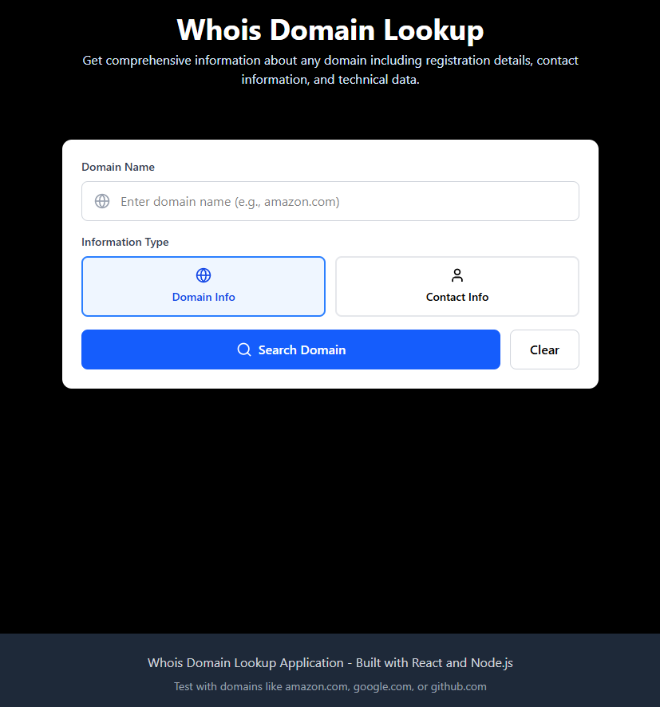
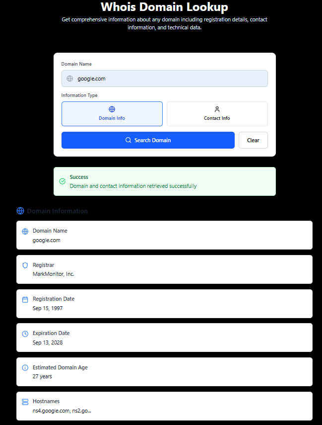

# Whois Domain Lookup

A full-stack web application for retrieving domain registration and contact information using the [WhoisXML API](https://whois.whoisxmlapi.com/). Built with **Express (Node.js)** for the backend and **React** with TailwindCSS & Lucide Icons on the frontend.

---

## Features

- Check domain registration, expiration, and age
- Retrieve registrant, administrative, and technical contact info
- API built with Express, calling WhoisXML
- Beautiful, modern UI with status indicators
- `.env`-based secure API key configuration

---

## Project Structure

```
root/
├── backend/          # Express API
│   ├── index.js
│   └── .env          # Not pushed – you create this
├── frontend/         # React app
│   ├── src/
│   ├── public/
│   └── package.json
└── README.md
```

---

## Prerequisites

- Node.js (v16+ recommended)
- npm or yarn
- [WhoisXML API Key](https://whoisxmlapi.com/)

---

## Setup Instructions

### 1. Clone the Repository

```bash
git clone https://github.com/JIhushiru/whoisDomain
cd whoisDomain
```

---

## Backend Setup (`/backend`)

### 2. Install Dependencies

```bash
cd backend
npm install
```

### 3. Create `.env` File

Create a `.env` file in the `/backend` folder:

```
WHOIS_API_KEY=your_api_key_here
PORT=5000
```

### 4. Run the Server

```bash
npm start
```

The API server will run on:

```
http://localhost:5000/api/whois?domain=example.com&type=domain
```

Health check:

```
http://localhost:5000/api/health
```

---

## Frontend Setup (`/frontend`)

### 5. Install Frontend Dependencies

```bash
cd ../frontend
npm install
```

> Ensure the proxy in `package.json` is set to:
```json
"proxy": "http://localhost:5000"
```

### 6. Run the Frontend

```bash
npm run dev
```

The React app will run at:

```
http://localhost:5173
```
> *(or check your terminal for the exact port Vite is using — usually it's `5173`, `5174`, etc.)*
---
### Run Both Servers Simultaneously

You must run **both servers at the same time** in separate terminals. Start from the source folder.

**Terminal 1 – Backend**

```bash
cd backend
npm start
```

**Terminal 2 – Frontend**

```bash
cd frontend
npm run dev
```

Once both are running, open your browser to:

```
http://localhost:5173
```
> *(or check your terminal for the exact port Vite is using — usually it's `5173`, `5174`, etc.)*
---


## Sample Domains to Test

- `google.com`
- `amazon.com`
- `github.com`

---

## Troubleshooting

- **API Key Errors**: Check if `.env` has the correct `WHOIS_API_KEY`
- **CORS Errors**: Ensure `cors()` is enabled in backend
- **404 Errors**: Make sure backend is running on correct port and proxy is configured

---

## License

MIT License. Feel free to use and modify.

---

## Credits

- [WhoisXML API](https://whoisxmlapi.com/)
- React, Express, TailwindCSS, Lucide Icons

## Preview

### Homepage



### Domain Result


